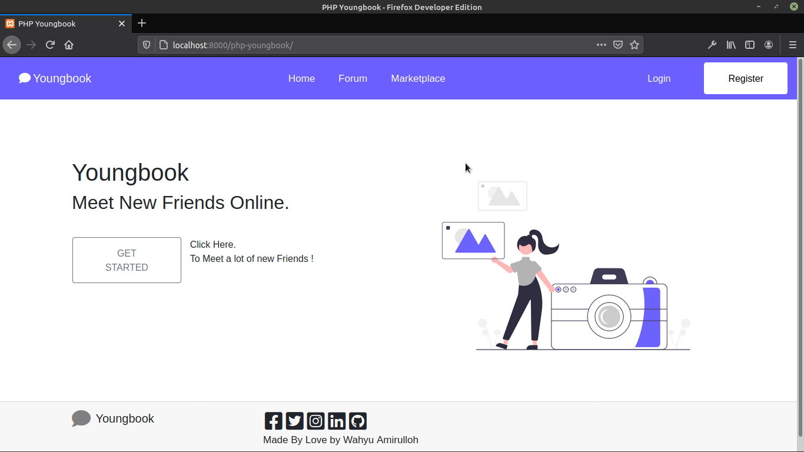
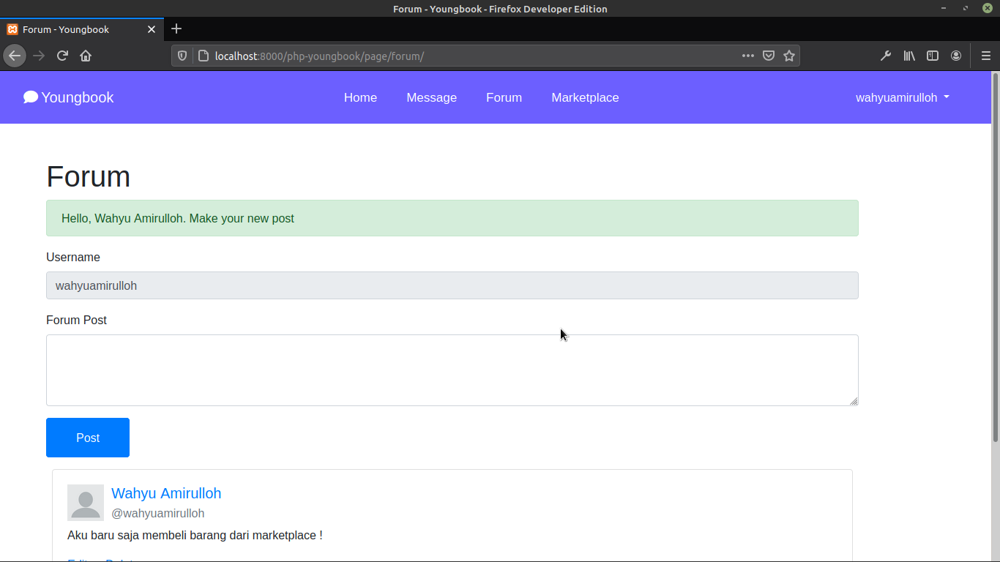
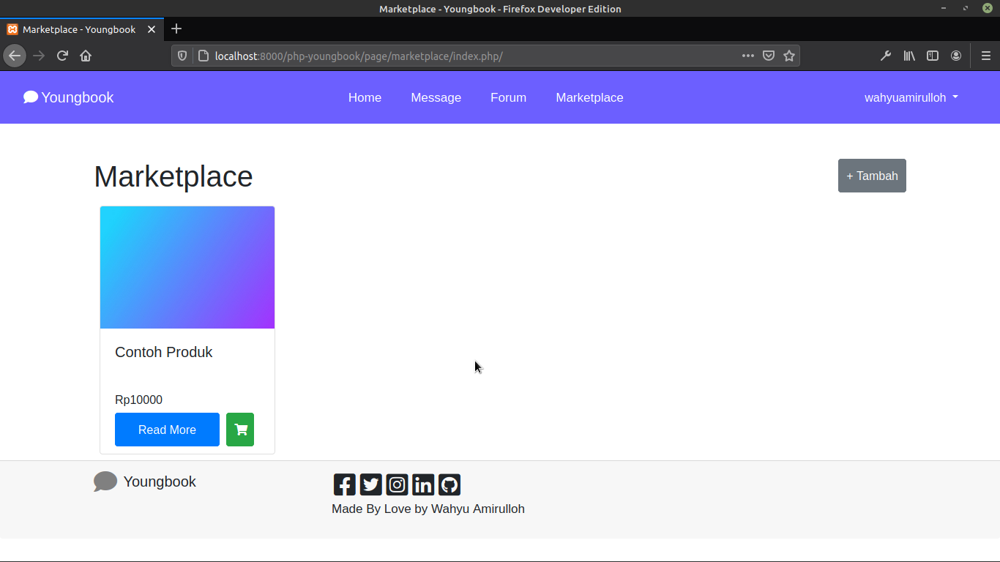
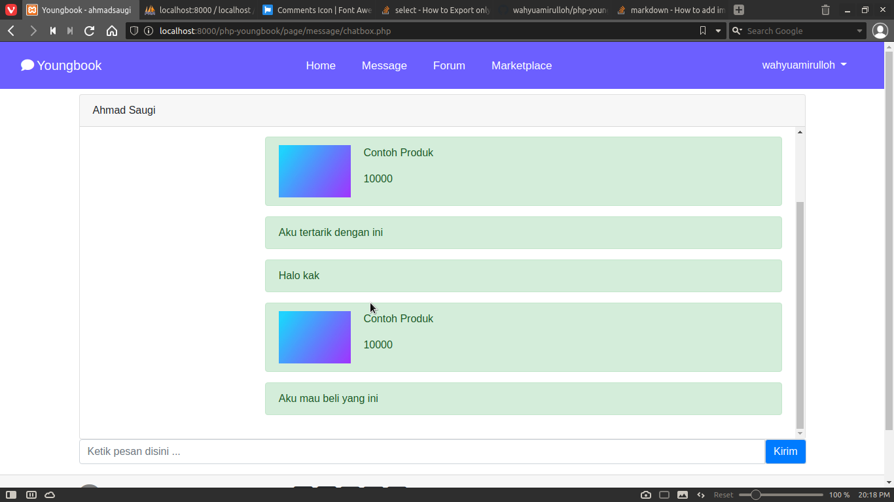

# YoungBook - Get new information through the internet ! Your new social world
## What is YoungBook
Youngbook is an open source social media that developed by Wahyu Amirulloh
You can do basic activities such as Post Text on Forum, Make a conversation with your friends and go to marketplace to get some cool stuff from other user

## Basic Start
### Signup
First, you'll need to signup your account, YoungBook need basic information like your name
For personalization information purpose you can input your bio and location to let other user know who you are
### Signin
If you have an account in Youngbook, You just need to signin with your username and password
### Forum
You can start make your post in Forum, start typing, and let other people interested to talk to you
### Message
Here we can talk to other people, you can send an information and message to online people
### Marketlace
Now, you can buy a lot of cool stuff from other users online, we filtered user by their location

> This is just basic information of this open source app, i will update soon as possible, the project is under development and we are don't open beta tester right now, for further information you can visit me on linkedin.com/wahyuamirulloh 

### Gallery View

> Selamat datang Selamat Bergabung, silahkan login atau register terlebih dahulu, kami sudah punya akun untuk langsung kamu pakai !

Username       | Password
---------------|----------------
wahyuamirulloh | wahyuamirulloh
ahamdsaugi     | ahmadsaugi


> Selamat Menggunakan ! Kamu bisa buat artikel kamu disini, buat orang lain tertarik mengunjungi profilmu dan mulai berinteraksi dengan orang !


> Ayo beli barang dari sesama pengguna Youngbook, Coba tekan icon keranjang belanja, maka kamu akan langsung berinteraksi dengan penjual !


> Berinteraksi sekarang dan hubungkan duniamu ! Selamat menggunakan

## How to Install ?
Tutorial membuka youngbook di Localhost komputermu
1. Clone Repository ini ke Komputermu
  1. Buka Command Prompt
  2. Pindah ke directory Xampp / Lampp kamu atau bisa dengan mudah salin saja perintah ini di Command Prompt berdasarkan sistem operasi kamu
  
  Windows            | Linux
  -------------------|---------------------
  cd C:/xampp/htdocs | cd /opt/lampp/htdocs
  
  3. Copy perintah ini di Command Prompt
  ```bash
  git clone https://github.com/wahyuamirulloh/php-youngbook.git
  cd php-youngbook
  ```
  4. Buka Xampp / Lampp mu dan start Apache Web Server dan MySQL Database
  5. Buka browser kamu dan ketik ini di address bar kamu
  ``` Localhost:<port-kamu>/php-youngbook ```
  
  Selamat, kamu telah berhasil membukanya

2. Instalasi Database
  1. Buka tab baru, lalu ketik ini di address bar kamu
  ``` Localbost:<port-kamu>/phpmyadmin ```
  2. Buat database baru dengan Nama Basis Data 'php-youngbook'
  3. Klik tab Impor pada phpmyadmin
  4. Pada kolom 'Berkas Untuk Impor', klik 'Choose File' pada 'Telusuri Komputer Anda'
  5. Ikuti direktori ini untuk menemukan file php-youngbook
  
  Windows                       | Linux
  ------------------------------|--------------------------------
  C:/xampp/htdocs/php-youngbook | /opt/lampp/htdocs/php-youngbook
  
  6. Masuk ke folder sql dan pilih file 'php-youngbook.sql'
  7. Tunggu hingga proses selesai dan beberapa tabel selesai dibuat
  8. Selamat, Kamu sudah mulai bisa menggunakannya !
  
3. Jalankan Website
  Buka browser kamu dan ketik ini di address bar kamu
  ``` Localhost:<port-kamu>/php-youngbook ```
  
  *Pastikan kamu telah mengaktifkan Apache Web Server dan MySQL Database*
  *Hubungi saya apabila menemukan kesalahan atau kesulitan dalam menggunakan*
  
  * Facebook :  Wahyu Amirulloh
  * Instagram : @wahyuamirulloh
  * GitHub : github.com/wahyuamirulloh
  * LinkedIn : linkedin.com/in/wahyuamirulloh

## Changelog
> Status : Under Development
> Version : 0.6.1 ( 50% ) First Alpha Access
### Changelog :
- ( 08/11/2020 - 03/11/2020 ) - Development on Forum, Messages and Profile
- ( 04/11/2020 - 09/11/2020 ) - Development on Marketplace

### TO DO Next Update
- Forum Post Friends Timeline
- Add Friend Button
- Friend Page
